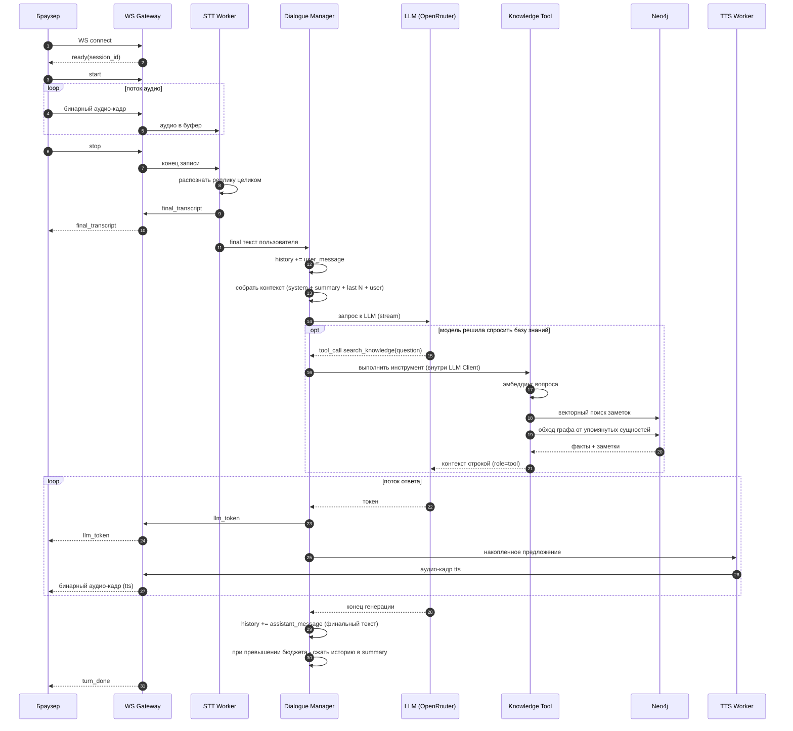
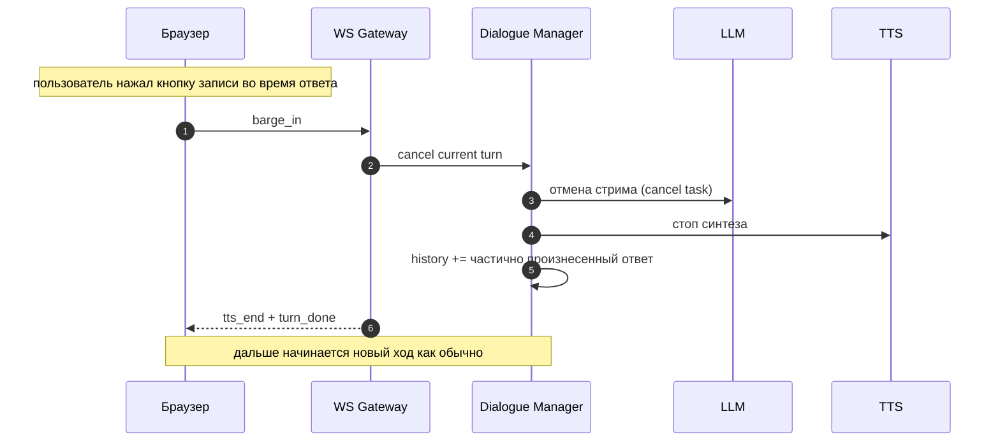

# Архитектурный план доработки сервиса voice-assistant-v2

Документ описывает архитектуру монолитного демо-сервиса на Python 3.13 (FastAPI),
который принимает голосовые команды из браузера, распознает их локально,
отправляет текст в выбранную LLM через OpenRouter и стримит озвученный ответ обратно
в браузер. Контекст диалога хранится в оперативной памяти сервиса.

Новое в этой версии плана (ДЗ к уроку 11): у сервиса появляется графовая база
данных Neo4j с двумя слоями - лексическим графом (Lexical Graph, тексты заметок
с векторными эмбеддингами) и доменным графом (Domain Graph, сущности и связи
между ними). Поверх них строится гибридный поиск (по смыслу + по связям),
доступный модели как инструмент `search_knowledge` по аналогии с `get_weather`.

Это учебный демо-проект. Архитектура намеренно держится максимально простой.

---

## 1. Цель и рамки

Что делает сервис:

- отдает web-интерфейс с кнопкой записи голоса
- принимает поток аудио с микрофона пользователя
- распознает речь локально моделью типа Whisper (STT)
- отправляет распознанный текст в LLM через OpenRouter (streaming)
- озвучивает ответ LLM локально (TTS) и стримит звук обратно в браузер
- удерживает контекст разговора в RAM все время работы сервиса
- сжимает контекст, когда он вырастает сверх заданного бюджета токенов
- хранит базу знаний в Neo4j: заметки с эмбеддингами плюс граф сущностей
- отвечает на вопросы по базе знаний через гибридный поиск, который модель
  вызывает сама как инструмент `search_knowledge`

Чего в демо сознательно нет (вынесено за рамки):

- авторизации, многопользовательских аккаунтов
- горизонтального масштабирования, очередей, воркеров
- MCP, мультиагентности
- хранения истории диалога между перезапусками сервиса (в Neo4j живет только
  база знаний, история разговора остается в RAM)
- автоматического извлечения сущностей из произвольных документов (NER),
  набор данных готовится оффлайн скриптом наполнения

Как это закрывает критерии приемки ДЗ (урок 11):

- работает поиск по данным - векторный поиск по заметкам через нативный
  векторный индекс Neo4j, запрос эмбеддится локальной моделью
- реализованы связи между объектами - доменный граф (Person, Company,
  Technology, Project и отношения между ними) хранится в той же Neo4j
- гибридный поиск - инструмент `search_knowledge` сначала находит заметки по
  смыслу, затем расширяет результат обходом графа от упомянутых сущностей
- показан результат ответа - в README фиксируется пример вопроса и ответа
  ассистента, часть фактов для которого существует только в связях графа

---

## 2. Ключевое отличие от примера с вебинара

В референсе `Otus.dev-ai-agents.Webinar8.sse-main` голос обрабатывался внешним
OpenAI Realtime API. Браузер устанавливал WebRTC-соединение напрямую с OpenAI, а
backend только выдавал ephemeral-ключ и в медиапоток не входил. STT и TTS целиком
жили внутри Realtime-сессии.

У нас задача обратная. STT (Whisper) и TTS работают локально на нашем сервере,
поэтому аудио с микрофона должно дойти именно до нашего Python-бэкенда, а не до
OpenAI. Это меняет выбор транспорта - см. раздел 3.

Что берем из примера как полезные паттерны:

- OpenRouter как OpenAI-совместимый провайдер LLM
- потоковую передачу токенов ответа в браузер по мере генерации
- отдачу статических файлов фронтенда самим бэкендом (монолит)
- хранение активных соединений в словаре по идентификатору сессии
- аккуратную деградацию при отказе (нет микрофона - текстовый ввод, и т д)

Из примеров к уроку 11 (`neo4j_demo`, `graph_rag_demo`) берем:

- идею двух слоев в одной Neo4j: документы-заметки поверх тех же узлов
  сущностей, что и граф знаний (связь через MENTIONS)
- прием "часть фактов есть только в графе": связи между сущностями сознательно
  не дублируются в текстах заметок, чтобы был виден выигрыш гибридного поиска
- стиль Cypher-запросов: выборка фактов и подбор документов-подтверждений
  двумя отдельными запросами

Генератор синтетических данных не пишем свой - за основу берется целиком
подкинутый проект `data-generator` (пакет `graph_generator`: доменный граф,
документы с фрагментами и выгрузка в Neo4j на чистом Cypher без APOC).
Скрипт наполнения только добавляет к нему эмбеддинги фрагментов и векторный
индекс.

---

## 3. Выбор транспорта

Нужно передавать три разнородных потока:

1. аудио от пользователя к серверу (микрофон, бинарный, непрерывный)
2. текстовые события от сервера к пользователю (частичный и финальный транскрипт, токены LLM, статусы)
3. аудио ответа от сервера к пользователю (бинарный, непрерывный)

Сравнение вариантов:

- SSE - только один канал сервер -> клиент и только текст. Не может принять аудио
  с микрофона. Не подходит как основной транспорт
- WebRTC - отличная задержка, но избыточно сложен (SDP, ICE, STUN/TURN, secure
  context). Оправдан, когда браузер общается напрямую с медиасервисом. У нас
  медиа терминируется на своем бэкенде, поэтому сложность не окупается
- WebSocket - один двунаправленный канал, умеет и бинарные, и текстовые кадры.
  Просто поднимается в FastAPI. Идеально ложится на монолит-демо

Решение: один WebSocket на сессию (`/ws`) несет все три потока сразу.

- вверх (клиент -> сервер): бинарные кадры PCM16 с микрофона плюс редкие управляющие
  JSON-сообщения (`start`, `stop`, `barge_in`)
- вниз (сервер -> клиент): текстовые JSON-события (транскрипт, токены, статусы) и
  бинарные кадры с аудио TTS

Так весь стриминг идет через одно соединение, состояние сессии привязано к нему,
и не нужно согласовывать несколько каналов между собой.

---

## 4. Обзор компонентов

```text
Браузер (web UI)
  microphone -> AudioWorklet (PCM16, 16 kHz)
      |  бинарные аудио-кадры
      v
  WebSocket  <---- JSON события (транскрипт, токены) + бинарное аудио TTS ----
      |
======|=================== FastAPI монолит =============================
      v
  WS Gateway (роутер соединения, буфер аудио)
      |
      v
  STT Worker (faster-whisper)         -- final транскрипт после конца записи
      |
      v
  Dialogue Manager  <------------------------- контур состояния диалога
      |  собирает реплики, хранит историю в RAM, формирует контекст
      v
  LLM Client (OpenRouter, streaming)  -- токены ответа
      |         |
      |         | function calling (get_weather, search_knowledge)
      |         v
      |   Tools: weather.py --------> Open-Meteo API
      |          knowledge.py ------> Neo4j (гибридный поиск)
      |                                  |
      |                                  +-- векторный индекс заметок
      |                                  +-- доменный граф сущностей
      v
  TTS Worker (локальный, streaming)   -- аудио-кадры по мере готовности
      |
      v
  WS Gateway -> браузер (аудио + текст)
```

Модули бэкенда:

- WS Gateway - принимает соединение, буферизует входящее аудио, маршрутизирует
  события наверх и вниз. Не знает про диалог, это тонкий транспортный слой
- STT Worker - локальная модель распознавания. Реплика распознается целиком после
  остановки записи, VAD опционально отсекает тишину по краям
- Dialogue Manager - единственный владелец контекста. Собирает реплики, хранит
  историю, формирует запрос к LLM, решает когда сжимать историю
- LLM Client - потоковый вызов OpenRouter (OpenAI-совместимый), с ретраями и
  циклом вызова инструментов
- Tools Registry - общий реестр инструментов (спеки + обработчики), из него
  LLM Client берет список для function calling
- Knowledge Tool - гибридный поиск по Neo4j: эмбеддинг вопроса, векторный
  поиск заметок, расширение по связям графа, форматирование контекста
- Embedder - локальная модель эмбеддингов (sentence-transformers), общая для
  скрипта наполнения и поиска
- TTS Worker - локальный синтез речи, отдает аудио по предложениям

STT, LLM и TTS - это относительно "тупые" потоковые процессоры. Они ничего не знают
о диалоге. Вся логика контекста сосредоточена в Dialogue Manager. Инструменты
для Dialogue Manager прозрачны - цикл function calling целиком живет в LLM Client.

---

## 5. Выбранная схема решения и упрощения

Схема с двумя независимыми контурами (потоковая обработка STT -> LLM -> TTS
отдельно, а управление состоянием диалога отдельно через Dialogue Manager) - это
общепринятый подход для голосовых ассистентов. Мы берем его за основу.
Но для демо ряд вещей упрощаем, чтобы не тащить сложность продакшн-ассистента.

Что оставляем:

- разделение на потоковый контур и контур управления состоянием
- Dialogue Manager как единственный владелец истории и контекста
- правило "в историю попадает только финальная реплика пользователя"
- правило "ответ ассистента пишется в историю только после конца генерации"
- многоуровневую память с периодическим сжатием старой истории в summary

Что упрощаем и почему:

1. Partial-транскрипт делаем опциональным. Whisper (в отличие от потоковых ASR
   вроде Vosk) распознает не по одному слову, а кусками. Конец реплики определяет
   сам пользователь по схеме push-to-talk: отпустил кнопку записи - реплика
   закончилась, распознаем ее целиком, это и есть "final". VAD для endpointing
   при такой схеме не нужен, он лишь опционально отсекает тишину по краям записи.
   Partial-гипотезы, если делаем, показываем в UI только как "черновик" для
   ощущения живости, в историю они не идут. Это заметно снижает сложность

2. Модель памяти ужимаем с четырех блоков до трех. Вместо
   System + Memory Summary + Important Facts + Last Dialogue используем
   System + Rolling Summary + Last N turns. Отдельное извлечение "важных фактов о
   пользователе" - это самостоятельная и не самая простая задача (нужен экстрактор
   фактов и их дедупликация). Для демо факты естественно оседают в Rolling Summary,
   отдельный блок не заводим

3. Перебивание (barge-in) оставляем, но в простом виде. Перебиванием считаем
   нажатие кнопки записи во время воспроизведения ответа - при push-to-talk
   клиент не может сам понять, что пользователь заговорил. Не пытаемся вычленять
   "реально произнесенную ассистентом часть" с точностью до слова. При перебивании
   отменяем генерацию LLM и воспроизведение TTS, а в историю пишем ту часть текста
   ответа, которую сервер успел отдать в TTS на момент отмены. Это дешево и
   достаточно честно для демо

4. Базу знаний не встраиваем в контекст каждого хода. Ретрив выполняется только
   когда модель сама решила позвать инструмент `search_knowledge` - так вопрос
   "какая погода" не тащит в контекст куски графа, а вопрос про сотрудников не
   зовет Open-Meteo. Это дешевле и проще, чем классический RAG "на каждый ход",
   и повторяет уже обкатанный на `get_weather` паттерн

Итог: схема двух контуров принимается целиком, меняется только глубина
реализации отдельных механизмов.

---

## 6. Два контура

### Контур A - потоковая обработка (per-turn, короткоживущий)

Живет ровно один ход диалога и не помнит ничего между ходами:

```text
mic -> WS -> [аудио-буфер] -> stop от клиента -> STT (реплика целиком) -> final текст
final текст -> Dialogue Manager -> контекст -> LLM (stream)
LLM токены -> нарезка на предложения -> TTS (stream) -> WS -> динамик
```

Если модель внутри хода запросила инструмент (погоду или базу знаний), LLM
Client выполняет его, подкладывает результат в сообщения и продолжает стрим.
Для контура A это выглядит просто как пауза перед первыми токенами.

### Контур B - управление состоянием (Dialogue Manager, живет всю сессию)

Хранит и формирует контекст:

- принимает финальную реплику пользователя от STT
- добавляет ее в историю
- формирует запрос к LLM из системного промпта, summary и последних N реплик
- по завершении ответа дописывает финальный текст ассистента в историю
- следит за бюджетом токенов и запускает сжатие истории

Контуры общаются через простые сообщения (в рамках процесса - через `asyncio`
очереди или прямые await-вызовы). STT кидает событие `final_transcript`,
Dialogue Manager отвечает потоком токенов, которые уходят в TTS.

---

## 7. Модель памяти и контекста

Контекст держим в RAM, в объекте сессии. Один разговор на весь запуск сервиса
(демо однопользовательское, но структура допускает словарь сессий по `session_id`).

Структура контекста для запроса к LLM:

```text
[ System Prompt        ]  фиксированная роль ассистента
[ Rolling Summary      ]  сжатое резюме старой части разговора (может быть пустым)
[ Last N turns         ]  последние N пар user/assistant дословно
[ Новая реплика user   ]  только что распознанная финальная реплика
```

Параметры (из .env):

- `KEEP_LAST_TURNS` - сколько последних пар держим дословно (например 6)
- `SUMMARIZE_TRIGGER_TOKENS` - порог, после которого запускается сжатие

Алгоритм сжатия (простой):

1. после каждого завершенного хода считаем примерный размер истории в токенах
2. если превышен `SUMMARIZE_TRIGGER_TOKENS`, берем самые старые реплики (все, что
   вне последних N) и отправляем в LLM с промптом "сожми в краткое резюме"
3. полученное резюме дописываем к текущему Rolling Summary, а сжатые реплики из
   дословной истории удаляем
4. последние N реплик всегда остаются дословно

Так размер контекста остается ограниченным, а разговор продолжается сколь угодно
долго. Оценку токенов для демо можно делать грубо (например через `tiktoken` или
эвристикой "символы делить на 4").

Рядом с оперативной памятью диалога появляется второй, долговременный слой -
база знаний в Neo4j (разделы 8 и 9). Она не участвует в сжатии и не хранится
в контексте постоянно: ее куски попадают в сообщения только как результат
вызова инструмента и живут по общим правилам истории.

---

## 8. Графовая база знаний в Neo4j

### 8.1 Запуск сервера

Neo4j поднимается через docker-compose в корне проекта (файл уже лежит в
`voice-assistant-v2/docker-compose.yml`):

- образ `neo4j:5`, наружу отдаются порты 7474 (веб-браузер Neo4j) и
  7687 (bolt для драйвера)
- креды задаются через `NEO4J_AUTH` (демо-значения, в бою так нельзя)
- данные живут в именованном томе `neo4j_data`, то есть переживают перезапуск
- healthcheck через `cypher-shell RETURN 1`, по нему видно что БД готова

Сам сервис приложения в docker не заворачиваем, он запускается как раньше
(run-скрипты), а к Neo4j ходит по `bolt://localhost:7687`. APOC не используем,
чтобы не менять конфиг образа - вся загрузка данных пишется на чистом Cypher.

Нужен векторный индекс, он есть в Neo4j начиная с 5.13, образ `neo4j:5`
тянет актуальную версию пятой ветки, этого достаточно.

### 8.2 Два слоя данных

Доменный граф (Domain Graph) - структурированные факты предметной области.
Модель целиком берется из генератора данных `data-generator`:

```text
(:Person     {id, name, email, position, experience})
(:Company    {id, name})
(:Technology {id, name, category})
(:Project    {id, name, type, status})

(Person)-[:WORKS_AT]->(Company)
(Person)-[:KNOWS]->(Technology)
(Person)-[:WORKS_ON]->(Project)
(Project)-[:OWNED_BY]->(Company)
(Project)-[:USES]->(Technology)
(Technology)-[:DEPENDS_ON]->(Technology)
```

Лексический граф (Lexical Graph) - документы, нарезанные на фрагменты и
повешенные на те же узлы сущностей (тоже модель `data-generator`):

```text
(:Document {id, title, kind})
(:Chunk    {id, text, order, embedding})

(Document)-[:FIRST_CHUNK]->(Chunk)
(Chunk)-[:PART_OF]->(Document)
(Chunk)-[:NEXT_CHUNK]->(Chunk)
(Chunk)-[:MENTIONS]->(Person | Company | Technology | Project)
```

`embedding` - вектор локальной модели эмбеддингов, по нему строится векторный
индекс:

```cypher
CREATE VECTOR INDEX chunk_embedding IF NOT EXISTS
FOR (n:Chunk) ON (n.embedding)
OPTIONS {indexConfig: {
    `vector.dimensions`: 384,
    `vector.similarity_function`: 'cosine'
}}
```

Ключевой прием из `graph_rag_demo`: тексты фрагментов описывают сущности
(профиль сотрудника, справка о проекте), но связи между сущностями в текстах
сознательно не проговариваются - кто где работает и какой проект какую
технологию использует, знает только граф. Именно на таких вопросах видно,
что дает гибридный поиск.

### 8.3 Наполнение (seed-скрипт)

Отдельный скрипт `seed_knowledge.py` в корне проекта, запускается вручную
один раз после подъема контейнера. Генерацию и выгрузку он не делает сам,
а берет из пакета `graph_generator` (папка `data-generator`):

1. `GraphGenerator` строит доменный граф с фиксированным seed, чтобы
   наполнение было воспроизводимым: 50 человек, 6 компаний, 12 технологий,
   15 проектов и связи между ними
2. там же генерируются документы лексического графа (профиль сотрудника,
   справка о проекте), нарезанные на фрагменты со списком упоминаний
3. скрипт считает эмбеддинги фрагментов локальной моделью (тот же Embedder,
   что и в поиске - одна модель на запись и на чтение, иначе векторы
   несовместимы)
4. `Neo4jExporter` пишет все в Neo4j пакетами через `UNWIND` и `MERGE` без
   APOC, создает constraint на `id` для каждой метки, скрипт добавляет
   векторный индекс по фрагментам
5. перед загрузкой граф очищается (`MATCH (n) DETACH DELETE n`) - скрипт
   можно гонять повторно, состояние всегда предсказуемое

Скрипт синхронный, обычный `neo4j.GraphDatabase.driver` - это оффлайн-утилита,
асинхронность ей не нужна.

---

## 9. Гибридный поиск и инструмент search_knowledge

### 9.1 Как модель получает доступ к базе

По аналогии с `get_weather` заводим второй инструмент. Спека для function
calling:

```json
{
  "type": "function",
  "function": {
    "name": "search_knowledge",
    "description": "Ищет ответ во внутренней базе знаний о сотрудниках, компаниях, проектах и технологиях. Используй, когда пользователь спрашивает про людей, их навыки, проекты, команды или стек технологий.",
    "parameters": {
      "type": "object",
      "properties": {
        "question": {
          "type": "string",
          "description": "Вопрос пользователя своими словами, на русском"
        }
      },
      "required": ["question"]
    }
  }
}
```

Реестр инструментов выносим из `weather.py` в отдельный модуль `app/tools.py`,
который собирает спеки и обработчики из weather и knowledge. LLM Client
начинает импортировать реестр оттуда, его цикл function calling не меняется -
для него это просто второй ключ в словаре обработчиков.

### 9.2 Пайплайн гибридного поиска

Обработчик `search_knowledge(question)` в `app/knowledge.py`:

```text
вопрос
  |
  v
1. эмбеддинг вопроса (локальная модель, та же что при наполнении)
  |
  v
2. векторный поиск: db.index.vector.queryNodes('chunk_embedding', top_k, $vec)
   -> top_k фрагментов с score
  |
  v
3. сбор сущностей: (chunk)-[:MENTIONS]->(entity) по найденным фрагментам
  |
  v
4. обход графа: от сущностей на 1-2 хопа по доменным связям
   (WORKS_AT, KNOWS, WORKS_ON, OWNED_BY, USES, DEPENDS_ON)
   -> факты вида "субъект - связь - объект"
  |
  v
5. форматирование контекста и возврат строки модели:
   [факты из графа]
   Alice Smith WORKS_AT Acme
   Alice Smith KNOWS Neo4j
   ...
   [выдержки]
   заголовок документа: текст фрагмента
```

Шаги 2 и 3+4 - два отдельных Cypher-запроса, как в `graph_rag_demo`: сначала
подобрать фрагменты по смыслу, потом добрать структуру. Количество фактов и
фрагментов ограничиваем параметрами, чтобы результат инструмента не раздувал
контекст (`KB_TOP_K`, `KB_MAX_HOPS`, `KB_MAX_FACTS`).

Результат возвращается одной строкой - модель перескажет его пользователю
голосом. Если по вопросу ничего не нашлось, возвращаем честный текст
"в базе знаний ничего не найдено", а не пустую строку, чтобы модель не
фантазировала.

### 9.3 Модель эмбеддингов

Локальная, через sentence-transformers, по умолчанию
`intfloat/multilingual-e5-small` (384 измерения, нормально держит русский).
Модель e5 требует префиксы: тексты заметок кодируются как `passage: ...`,
вопрос как `query: ...` - это фиксируем в одном месте, в модуле Embedder.

Кодирование - блокирующий CPU-вызов, поэтому в обработчике инструмента
заворачиваем его в `asyncio.to_thread`, чтобы не стопорить event loop и
стриминг других событий. Модель грузим лениво при первом вызове и держим
в памяти процесса.

### 9.4 Доступ к Neo4j из сервиса

- асинхронный драйвер `neo4j.AsyncGraphDatabase`, один экземпляр на процесс
- создается лениво при первом вызове инструмента, закрывается в shutdown
  приложения (lifespan в main.py)
- чтения идут через `execute_read` - драйвер сам ретраит transient-ошибки
- любая ошибка (БД не поднята, индекс не создан, кривой запрос) превращается
  в текст для модели: "база знаний сейчас недоступна" - тот же контракт, что
  у `get_weather`, инструмент никогда не роняет ход исключением

### 9.5 Пример сценария для сдачи ДЗ

Вопрос: "Кто из сотрудников Acme знает Neo4j и на каких проектах работает?"

- векторный поиск по смыслу находит профили людей, где упоминается Neo4j
- но принадлежность к Acme и список проектов в текстах не написаны - эти
  факты добираются обходом графа (WORKS_AT, WORKS_ON)
- модель получает факты плюс заметки и собирает полный ответ

Пара вопрос/ответ и вывод найденного контекста фиксируются в README как
результат для формата сдачи.

---

## 10. Протокол WebSocket

Одно соединение, кадры двух типов.

Бинарные кадры:

- вверх - чанки аудио с микрофона, PCM16, моно, 16 kHz
- вниз - чанки синтезированного аудио ответа (например PCM16 или закодированный
  формат, который умеет проигрывать браузер)

Текстовые кадры - JSON с полем `type`.

От клиента к серверу:

```json
{ "type": "start" }         // нажал кнопку записи
{ "type": "stop" }          // отпустил кнопку записи, реплика закончена
{ "type": "barge_in" }      // нажал кнопку записи во время воспроизведения ответа
{ "type": "text_input" }    // текстовый fallback без микрофона
```

От сервера к клиенту:

```json
{ "type": "ready",            "session_id": "..." }
{ "type": "kb_loading" }
{ "type": "kb_ready" }
{ "type": "final_transcript",  "text": "финальная реплика" }
{ "type": "llm_token",         "text": "очередной кусок ответа" }
{ "type": "tts_start" }
{ "type": "tts_end" }
{ "type": "turn_done" }
{ "type": "error",             "message": "описание" }
```

`kb_loading` уходит сразу после `ready`, пока на сервере греется
модель эмбеддингов для поиска по базе знаний - клиент блокирует
ввод до `kb_ready`, чтобы вопросы не копились в очереди отмен.

Вызовы инструментов в протокол не выносим - для клиента это просто пауза
перед токенами. При желании легко добавить событие `tool_call` для отладки,
но для демо хватает лога сервера.

---

## 11. Диаграмма одного хода диалога



Обработка перебивания:



---

## 12. Технологический стек

- Python 3.13
- FastAPI + uvicorn - HTTP, WebSocket, отдача статики фронтенда
- faster-whisper (CTranslate2) - локальный STT, компактный и быстрый
- webrtcvad или silero-vad - опциональная отсечка тишины по краям записи
- openai (Python SDK) с `base_url` на OpenRouter, либо httpx напрямую - streaming LLM
- локальный TTS: Piper (легкий, оффлайн, стримит по предложениям) как основной
  вариант. Альтернатива - edge-tts, если допустим внешний вызов
- neo4j (официальный Python driver, async) - графовая база знаний
- sentence-transformers - локальные эмбеддинги для векторного поиска
- faker - правдоподобные имена и почты в генераторе данных
- Docker + docker-compose - только для контейнера Neo4j
- pydantic-settings - чтение конфигурации из .env
- фронтенд - vanilla JS без сборщика: getUserMedia + AudioWorklet для захвата PCM16,
  Web Audio API для проигрывания входящих аудио-кадров

Выбор faster-whisper, Piper и sentence-transformers делает пайплайны STT, TTS
и эмбеддингов полностью локальными. Наружу ходят только вызов LLM через
OpenRouter и инструмент погоды. Отдельную векторную БД не заводим - векторный
индекс живет в той же Neo4j, что и граф, одной базой проще управлять и один
запрос может смешивать смысловой и структурный поиск.

Зависимости neo4j и sentence-transformers добавляем в optional-группу
`rag` в pyproject.toml, чтобы минимальная текстовая установка не тянула torch.

---

## 13. Структура проекта

```text
voice-assistant-v2/
├── .env.example
├── .env                      # не коммитим
├── docker-compose.yml        # контейнер Neo4j (порты 7474 и 7687, том данных)
├── pyproject.toml
├── README.md
├── main.py                   # FastAPI, роуты, монтирование статики, /ws, lifespan
├── seed_knowledge.py         # эмбеддинги и загрузка датасета в Neo4j + индекс
├── data-generator/           # подкинутый генератор графовых данных
│   ├── graph_generator/      # генерация, адаптер в граф, экспорт в Neo4j
│   ├── tests/                # тесты генератора
│   └── main.py               # автономный запуск без эмбеддингов
├── app/
│   ├── config.py             # pydantic-settings, чтение .env
│   ├── ws_gateway.py         # обработчик WebSocket, буфер аудио, маршрутизация
│   ├── dialogue_manager.py   # контекст, история, сжатие, оркестрация хода
│   ├── stt.py                # faster-whisper, распознавание реплики целиком
│   ├── llm_client.py         # OpenRouter streaming, ретраи, цикл инструментов
│   ├── tools.py              # общий реестр инструментов (спеки + обработчики)
│   ├── weather.py            # инструмент get_weather, Open-Meteo API
│   ├── knowledge.py          # инструмент search_knowledge, гибридный поиск в Neo4j
│   ├── embeddings.py         # обертка над sentence-transformers, префиксы e5
│   ├── tts.py                # локальный синтез, нарезка на предложения
│   ├── memory.py             # структура контекста и логика summary
│   └── static/
│       ├── index.html
│       ├── app.js            # WS, захват микрофона, проигрывание аудио
│       └── style.css
└── tests/                    # unit тесты чистых функций
```

Изменения относительно текущего состояния проекта:

- новые модули: `app/tools.py`, `app/knowledge.py`, `app/embeddings.py`,
  скрипт `seed_knowledge.py` и подкинутый пакет `data-generator`
- `app/llm_client.py` - импорт реестра инструментов из `app/tools.py`
  вместо `app/weather.py`, сам цикл не меняется
- `app/config.py` - настройки Neo4j, эмбеддингов и лимитов поиска
- `main.py` - закрытие драйвера Neo4j в lifespan
- `docker-compose.yml` уже в проекте, не меняется
- тесты: чистые функции форматирования фактов и заметок в контекст,
  разбор результата векторного поиска, реестр инструментов, обработчик
  search_knowledge с замоканным драйвером

---

## 14. Конфигурация (.env)

```bash
# Сервер
HOST=0.0.0.0
PORT=8000

# LLM через OpenRouter (OpenAI-совместимый API)
OPENROUTER_API_KEY=your-openrouter-key
OPENROUTER_BASE_URL=https://openrouter.ai/api/v1
OPENROUTER_MODEL=google/gemini-3.5-flash

# STT (локально)
WHISPER_MODEL=small
WHISPER_DEVICE=cpu           # или cuda
WHISPER_LANGUAGE=ru

# TTS (локально)
TTS_ENGINE=piper
TTS_VOICE=ru_RU-model

# Память и контекст
SYSTEM_PROMPT=Ты полезный голосовой ассистент. Отвечай кратко.
KEEP_LAST_TURNS=6
SUMMARIZE_TRIGGER_TOKENS=3000

# Neo4j (значения совпадают с docker-compose.yml)
NEO4J_URI=bolt://localhost:7687
NEO4J_USERNAME=neo4j
NEO4J_PASSWORD=graphdemo42
NEO4J_DATABASE=neo4j

# Гибридный поиск по базе знаний
EMBEDDING_MODEL=intfloat/multilingual-e5-small
KB_TOP_K=4                   # сколько заметок берем из векторного поиска
KB_MAX_HOPS=2                # глубина обхода графа от упомянутых сущностей
KB_MAX_FACTS=30              # предел фактов в контексте инструмента
```

Секреты держим только в .env, в репозиторий не коммитим. В репозиторий кладем
`.env.example` с плейсхолдерами. Пароль Neo4j в демо совпадает с compose-файлом
и секретом не считается, но в .env.example все равно кладем плейсхолдер.

---

## 15. Отказоустойчивость

Демо, но базовые сценарии отказа предусматриваем:

- OpenRouter недоступен или вернул ошибку - до 2-3 повторов с экспоненциальной
  паузой, при полном отказе шлем клиенту `error` и не портим историю (реплику
  пользователя оставляем, ответ ассистента не добавляем)
- Neo4j не поднята или недоступна - инструмент возвращает модели текст
  "база знаний сейчас недоступна", ход не падает, ассистент честно говорит
  об этом пользователю. Transient-ошибки чтения ретраит сам драйвер
- векторный индекс отсутствует (seed не запускали) - та же деградация в текст,
  плюс подсказка в лог сервера про seed_knowledge.py
- сбой модели эмбеддингов (не скачалась, нет места) - ловим при ленивой
  загрузке и отвечаем модели текстом ошибки, остальные функции сервиса живут
- нет доступа к микрофону в браузере - показываем текстовое поле ввода как fallback.
  Текстовый режим полностью покрывает сценарий ДЗ (поиск плюс streaming),
  поэтому демо воспроизводимо и без рабочего аудио-окружения
- обрыв WebSocket - на сервере чистим буфер и незавершенный ход этой сессии
- перебивание во время ответа - корректно отменяем задачи LLM и TTS через
  `asyncio.CancelledError`, состояние истории оставляем согласованным
- seed-скрипт при ошибке загрузки можно просто перезапустить - он начинает
  с очистки графа, полусостояний не остается

История диалога в RAM теряется при перезапуске сервиса - это осознанное
ограничение демо. База знаний в Neo4j при этом сохраняется в томе docker.

---

## 16. Что сознательно упрощено (сводка)

- один пользователь и один разговор на запуск (но структура готова к словарю сессий)
- нет persist истории диалога, все в RAM (в Neo4j только база знаний)
- конец реплики определяет кнопка записи (push-to-talk), VAD лишь отсекает тишину
- partial-транскрипта нет, реплика распознается целиком после отпускания кнопки
- модель памяти из трех блоков вместо четырех, факты растворены в summary
- barge-in - это нажатие кнопки записи во время ответа, без пословной точности
- источники знаний: сама LLM, инструмент get_weather для погоды по API и
  инструмент search_knowledge для вопросов по базе знаний в Neo4j
- набор данных синтетический и грузится оффлайн скриптом, автоматического
  извлечения сущностей из документов нет
- ретрив только по запросу модели (function calling), классического
  RAG-конвейера "на каждый ход" нет
- один векторный индекс и одна модель эмбеддингов, без реранкера и без
  гибридного скоринга bm25 + вектор
- tool-calling ограничен двумя инструментами, MCP и мультиагентности нет
- текстовый ввод остается как гарантированный fallback без аудио-зависимостей
