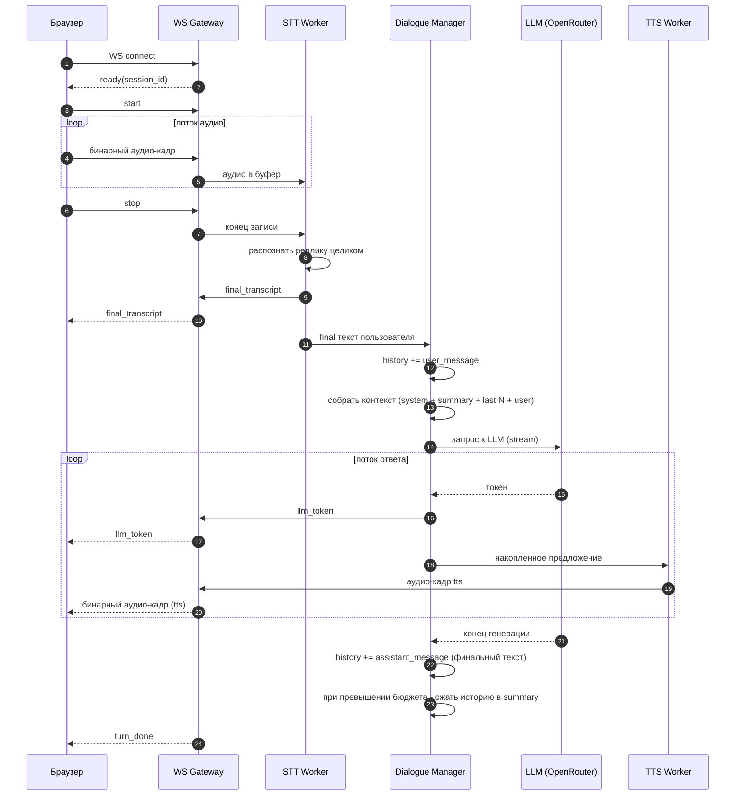
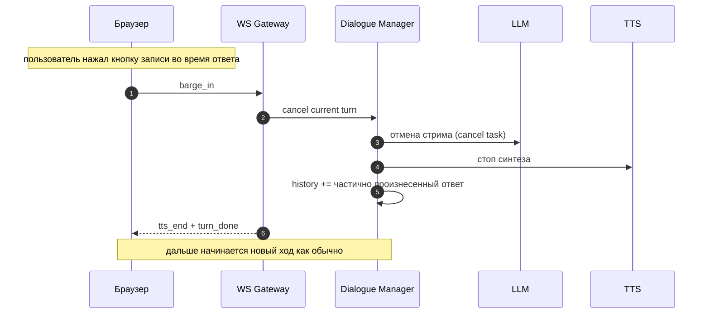

# Архитектурный план демо-сервиса голосового ассистента

Документ описывает архитектуру монолитного демо-сервиса на Python 3.13 (FastAPI),
который принимает голосовые команды из браузера, распознает их локально,
отправляет текст в выбранную LLM через OpenRouter и стримит озвученный ответ обратно
в браузер. Контекст диалога хранится в оперативной памяти сервиса.

Это учебный демо-проект. Архитектура намеренно держится максимально простой.

---

## 1. Цель и рамки

Что делает сервис:

- отдает web-интерфейс с кнопкой записи голоса
- принимает поток аудио с микрофона пользователя
- распознает речь локально моделью типа Whisper (STT)
- отправляет распознанный текст в LLM через OpenRouter (streaming)
- озвучивает ответ LLM локально (TTS) и стримит звук обратно в браузер
- удерживает контекст разговора в RAM все время работы сервиса
- сжимает контекст, когда он вырастает сверх заданного бюджета токенов

Чего в демо сознательно нет (вынесено за рамки):

- авторизации, многопользовательских аккаунтов, persist в БД
- горизонтального масштабирования, очередей, воркеров
- MCP, мультиагентности
- хранения истории между перезапусками сервиса

Как это закрывает критерии приемки ДЗ:

- передача контекста - внешним источником контекста по API служит инструмент
  get_weather (Open-Meteo), который модель вызывает сама через function calling,
  а контекст диалога (системный промпт, summary, последние реплики) собирает
  Dialogue Manager и передает в модель на каждом ходе
- streaming ответа - токены LLM и аудио TTS стримятся в браузер по мере генерации
- воспроизводимость сценария - кроме голоса всегда доступен текстовый ввод,
  который не требует микрофона и локальных аудио-моделей

---

## 2. Ключевое отличие от примера с вебинара

В референсе `Otus.dev-ai-agents.Webinar8.sse-main` голос обрабатывался внешним
OpenAI Realtime API. Браузер устанавливал WebRTC-соединение напрямую с OpenAI, а
backend только выдавал ephemeral-ключ и в медиапоток не входил. STT и TTS целиком
жили внутри Realtime-сессии.

У нас задача обратная. STT (Whisper) и TTS работают локально на нашем сервере,
поэтому аудио с микрофона должно дойти именно до нашего Python-бэкенда, а не до
OpenAI. Это меняет выбор транспорта - см. раздел 3.

Что берем из примера как полезные паттерны:

- OpenRouter как OpenAI-совместимый провайдер LLM
- потоковую передачу токенов ответа в браузер по мере генерации
- отдачу статических файлов фронтенда самим бэкендом (монолит)
- хранение активных соединений в словаре по идентификатору сессии
- аккуратную деградацию при отказе (нет микрофона - текстовый ввод, и т д)

---

## 3. Выбор транспорта

Нужно передавать три разнородных потока:

1. аудио от пользователя к серверу (микрофон, бинарный, непрерывный)
2. текстовые события от сервера к пользователю (частичный и финальный транскрипт, токены LLM, статусы)
3. аудио ответа от сервера к пользователю (бинарный, непрерывный)

Сравнение вариантов:

- SSE - только один канал сервер -> клиент и только текст. Не может принять аудио
  с микрофона. Не подходит как основной транспорт
- WebRTC - отличная задержка, но избыточно сложен (SDP, ICE, STUN/TURN, secure
  context). Оправдан, когда браузер общается напрямую с медиасервисом. У нас
  медиа терминируется на своем бэкенде, поэтому сложность не окупается
- WebSocket - один двунаправленный канал, умеет и бинарные, и текстовые кадры.
  Просто поднимается в FastAPI. Идеально ложится на монолит-демо

Решение: один WebSocket на сессию (`/ws`) несет все три потока сразу.

- вверх (клиент -> сервер): бинарные кадры PCM16 с микрофона плюс редкие управляющие
  JSON-сообщения (`start`, `stop`, `barge_in`)
- вниз (сервер -> клиент): текстовые JSON-события (транскрипт, токены, статусы) и
  бинарные кадры с аудио TTS

Так весь стриминг идет через одно соединение, состояние сессии привязано к нему,
и не нужно согласовывать несколько каналов между собой.

---

## 4. Обзор компонентов

```text
Браузер (web UI)
  microphone -> AudioWorklet (PCM16, 16 kHz)
      |  бинарные аудио-кадры
      v
  WebSocket  <---- JSON события (транскрипт, токены) + бинарное аудио TTS ----
      |
======|=================== FastAPI монолит =============================
      v
  WS Gateway (роутер соединения, буфер аудио)
      |
      v
  STT Worker (faster-whisper)         -- final транскрипт после конца записи
      |
      v
  Dialogue Manager  <------------------------- контур состояния диалога
      |  собирает реплики, хранит историю в RAM, формирует контекст
      v
  LLM Client (OpenRouter, streaming)  -- токены ответа
      |
      v
  TTS Worker (локальный, streaming)   -- аудио-кадры по мере готовности
      |
      v
  WS Gateway -> браузер (аудио + текст)
```

Модули бэкенда:

- WS Gateway - принимает соединение, буферизует входящее аудио, маршрутизирует
  события наверх и вниз. Не знает про диалог, это тонкий транспортный слой
- STT Worker - локальная модель распознавания. Реплика распознается целиком после
  остановки записи, VAD опционально отсекает тишину по краям
- Dialogue Manager - единственный владелец контекста. Собирает реплики, хранит
  историю, формирует запрос к LLM, решает когда сжимать историю
- LLM Client - потоковый вызов OpenRouter (OpenAI-совместимый), с ретраями
- TTS Worker - локальный синтез речи, отдает аудио по предложениям

STT, LLM и TTS - это относительно "тупые" потоковые процессоры. Они ничего не знают
о диалоге. Вся логика контекста сосредоточена в Dialogue Manager.

---

## 5. Выбранная схема решения и упрощения

Схема с двумя независимыми контурами (потоковая обработка STT -> LLM -> TTS
отдельно, а управление состоянием диалога отдельно через Dialogue Manager) - это
общепринятый подход для голосовых ассистентов. Мы берем его за основу.
Но для демо ряд вещей упрощаем, чтобы не тащить сложность продакшн-ассистента.

Что оставляем:

- разделение на потоковый контур и контур управления состоянием
- Dialogue Manager как единственный владелец истории и контекста
- правило "в историю попадает только финальная реплика пользователя"
- правило "ответ ассистента пишется в историю только после конца генерации"
- многоуровневую память с периодическим сжатием старой истории в summary

Что упрощаем и почему:

1. Partial-транскрипт делаем опциональным. Whisper (в отличие от потоковых ASR
   вроде Vosk) распознает не по одному слову, а кусками. Конец реплики определяет
   сам пользователь по схеме push-to-talk: отпустил кнопку записи - реплика
   закончилась, распознаем ее целиком, это и есть "final". VAD для endpointing
   при такой схеме не нужен, он лишь опционально отсекает тишину по краям записи.
   Partial-гипотезы, если делаем, показываем в UI только как "черновик" для
   ощущения живости, в историю они не идут. Это заметно снижает сложность

2. Модель памяти ужимаем с четырех блоков до трех. Вместо
   System + Memory Summary + Important Facts + Last Dialogue используем
   System + Rolling Summary + Last N turns. Отдельное извлечение "важных фактов о
   пользователе" - это самостоятельная и не самая простая задача (нужен экстрактор
   фактов и их дедупликация). Для демо факты естественно оседают в Rolling Summary,
   отдельный блок не заводим

3. Перебивание (barge-in) оставляем, но в простом виде. Перебиванием считаем
   нажатие кнопки записи во время воспроизведения ответа - при push-to-talk
   клиент не может сам понять, что пользователь заговорил. Не пытаемся вычленять
   "реально произнесенную ассистентом часть" с точностью до слова. При перебивании
   отменяем генерацию LLM и воспроизведение TTS, а в историю пишем ту часть текста
   ответа, которую сервер успел отдать в TTS на момент отмены. Это дешево и
   достаточно честно для демо

Итог: схема двух контуров принимается целиком, меняется только глубина
реализации отдельных механизмов.

---

## 6. Два контура

### Контур A - потоковая обработка (per-turn, короткоживущий)

Живет ровно один ход диалога и не помнит ничего между ходами:

```text
mic -> WS -> [аудио-буфер] -> stop от клиента -> STT (реплика целиком) -> final текст
final текст -> Dialogue Manager -> контекст -> LLM (stream)
LLM токены -> нарезка на предложения -> TTS (stream) -> WS -> динамик
```

### Контур B - управление состоянием (Dialogue Manager, живет всю сессию)

Хранит и формирует контекст:

- принимает финальную реплику пользователя от STT
- добавляет ее в историю
- формирует запрос к LLM из системного промпта, summary и последних N реплик
- по завершении ответа дописывает финальный текст ассистента в историю
- следит за бюджетом токенов и запускает сжатие истории

Контуры общаются через простые сообщения (в рамках процесса - через `asyncio`
очереди или прямые await-вызовы). STT кидает событие `final_transcript`,
Dialogue Manager отвечает потоком токенов, которые уходят в TTS.

---

## 7. Модель памяти и контекста

Контекст держим в RAM, в объекте сессии. Один разговор на весь запуск сервиса
(демо однопользовательское, но структура допускает словарь сессий по `session_id`).

Структура контекста для запроса к LLM:

```text
[ System Prompt        ]  фиксированная роль ассистента
[ Rolling Summary      ]  сжатое резюме старой части разговора (может быть пустым)
[ Last N turns         ]  последние N пар user/assistant дословно
[ Новая реплика user   ]  только что распознанная финальная реплика
```

Параметры (из .env):

- `KEEP_LAST_TURNS` - сколько последних пар держим дословно (например 6)
- `SUMMARIZE_TRIGGER_TOKENS` - порог, после которого запускается сжатие

Алгоритм сжатия (простой):

1. после каждого завершенного хода считаем примерный размер истории в токенах
2. если превышен `SUMMARIZE_TRIGGER_TOKENS`, берем самые старые реплики (все, что
   вне последних N) и отправляем в LLM с промптом "сожми в краткое резюме"
3. полученное резюме дописываем к текущему Rolling Summary, а сжатые реплики из
   дословной истории удаляем
4. последние N реплик всегда остаются дословно

Так размер контекста остается ограниченным, а разговор продолжается сколь угодно
долго. Оценку токенов для демо можно делать грубо (например через `tiktoken` или
эвристикой "символы делить на 4").

---

## 8. Протокол WebSocket

Одно соединение, кадры двух типов.

Бинарные кадры:

- вверх - чанки аудио с микрофона, PCM16, моно, 16 kHz
- вниз - чанки синтезированного аудио ответа (например PCM16 или закодированный
  формат, который умеет проигрывать браузер)

Текстовые кадры - JSON с полем `type`.

От клиента к серверу:

```json
{ "type": "start" }         // нажал кнопку записи
{ "type": "stop" }          // отпустил кнопку записи, реплика закончена
{ "type": "barge_in" }      // нажал кнопку записи во время воспроизведения ответа
```

От сервера к клиенту:

```json
{ "type": "ready",            "session_id": "..." }
{ "type": "final_transcript",  "text": "финальная реплика" }
{ "type": "llm_token",         "text": "очередной кусок ответа" }
{ "type": "tts_start" }
{ "type": "tts_end" }
{ "type": "turn_done" }
{ "type": "error",             "message": "описание" }
```

Такой набор перекликается с событиями SSE из примера (`llm_token`,
`agent_finished`, `error`), но приспособлен под голосовой сценарий и двунаправленность.

---

## 9. Диаграмма одного хода диалога



Обработка перебивания:



---

## 10. Технологический стек

- Python 3.13
- FastAPI + uvicorn - HTTP, WebSocket, отдача статики фронтенда
- faster-whisper (CTranslate2) - локальный STT, компактный и быстрый
- webrtcvad или silero-vad - опциональная отсечка тишины по краям записи
- openai (Python SDK) с `base_url` на OpenRouter, либо httpx напрямую - streaming LLM
- локальный TTS: Piper (легкий, оффлайн, стримит по предложениям) как основной
  вариант. Альтернатива - edge-tts, если допустим внешний вызов
- pydantic-settings - чтение конфигурации из .env
- фронтенд - vanilla JS без сборщика: getUserMedia + AudioWorklet для захвата PCM16,
  Web Audio API для проигрывания входящих аудио-кадров

Выбор faster-whisper и Piper делает пайплайн STT и TTS полностью локальным и
оффлайновым. Наружу ходит только вызов LLM через OpenRouter.

---

## 11. Структура проекта

```text
voice-assistant/
├── .env.example
├── .env                      # не коммитим
├── pyproject.toml
├── README.md
├── ARCHITECTURE.md
├── main.py                   # FastAPI, роуты, монтирование статики, /ws
├── app/
│   ├── config.py             # pydantic-settings, чтение .env
│   ├── ws_gateway.py         # обработчик WebSocket, буфер аудио, маршрутизация
│   ├── dialogue_manager.py   # контекст, история, сжатие, оркестрация хода
│   ├── stt.py                # faster-whisper, распознавание реплики целиком
│   ├── llm_client.py         # OpenRouter streaming, ретраи, цикл инструментов
│   ├── weather.py            # инструмент get_weather, Open-Meteo API
│   ├── tts.py                # локальный синтез, нарезка на предложения
│   ├── memory.py             # структура контекста и логика summary
│   └── static/
│       ├── index.html
│       ├── app.js            # WS, захват микрофона, проигрывание аудио
│       └── style.css
└── tests/                    # unit тесты чистых функций
```

---

## 12. Конфигурация (.env)

```bash
# Сервер
HOST=0.0.0.0
PORT=8000

# LLM через OpenRouter (OpenAI-совместимый API)
OPENROUTER_API_KEY=your-openrouter-key
OPENROUTER_BASE_URL=https://openrouter.ai/api/v1
OPENROUTER_MODEL=google/gemini-3.5-flash

# STT (локально)
WHISPER_MODEL=small
WHISPER_DEVICE=cpu           # или cuda
WHISPER_LANGUAGE=ru

# TTS (локально)
TTS_ENGINE=piper
TTS_VOICE=ru_RU-model

# Память и контекст
SYSTEM_PROMPT=Ты полезный голосовой ассистент. Отвечай кратко.
KEEP_LAST_TURNS=6
SUMMARIZE_TRIGGER_TOKENS=3000
```

Секреты держим только в .env, в репозиторий не коммитим. В репозиторий кладем
`.env.example` с плейсхолдерами.

---

## 13. Отказоустойчивость

Демо, но базовые сценарии отказа предусматриваем:

- OpenRouter недоступен или вернул ошибку - до 2-3 повторов с экспоненциальной
  паузой, при полном отказе шлем клиенту `error` и не портим историю (реплику
  пользователя оставляем, ответ ассистента не добавляем)
- нет доступа к микрофону в браузере - показываем текстовое поле ввода как fallback.
  Текстовый режим полностью покрывает сценарий ДЗ (контекст плюс streaming),
  поэтому демо воспроизводимо и без рабочего аудио-окружения
- обрыв WebSocket - на сервере чистим буфер и незавершенный ход этой сессии
- перебивание во время ответа - корректно отменяем задачи LLM и TTS через
  `asyncio.CancelledError`, состояние истории оставляем согласованным

История в RAM теряется при перезапуске сервиса - это осознанное ограничение демо.

---

## 14. Что сознательно упрощено (сводка)

- один пользователь и один разговор на запуск (но структура готова к словарю сессий)
- нет persist истории, все в RAM
- конец реплики определяет кнопка записи (push-to-talk), VAD лишь отсекает тишину
- partial-транскрипта нет, реплика распознается целиком после отпускания кнопки
- модель памяти из трех блоков вместо четырех, факты растворены в summary
- barge-in - это нажатие кнопки записи во время ответа, без пословной точности
- внешней базы знаний нет, источником знаний выступает сама LLM,
  плюс один инструмент get_weather для актуальной погоды по API
- текстовый ввод остается как гарантированный fallback без аудио-зависимостей
- tool-calling ограничен одним инструментом, MCP и мультиагентности нет
